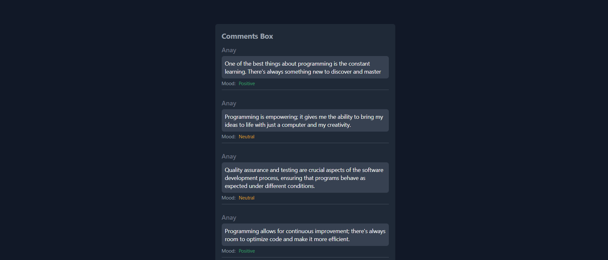

# Full Stack Comments Sentiment Analysis

This project consists of a Python Flask backend and a React frontend. The backend fetches comments from a specific Facebook post and analyzes their sentiment using the TextBlob library. The frontend displays the comments and their sentiment analysis.



## Setup

### Backend

1. Navigate to the `Backend` directory:

```bash
cd Backend
```

2. Install the required dependencies


3. Create a `.env` file in the `Backend` directory and add your Facebook Page ID, Post ID, and Access Token:

```env
PAGE_ID=<your-page-id>
POST_ID=<your-post-id>
ACCESS_TOKEN=<your-access-token>
```

### Frontend

1. Navigate to the `frontend` directory:

```bash
cd frontend
```

2. Install the required dependencies:

```bash
npm install
```

## Running the Application

### Backend

To run the backend, use the following command:

```bash
python main.py
```

The backend will start a server at `http://localhost:5000`.

### Frontend

To run the frontend, use the following command:

```bash
npm run dev
```

The frontend will start a server at `http://localhost:5173`.
